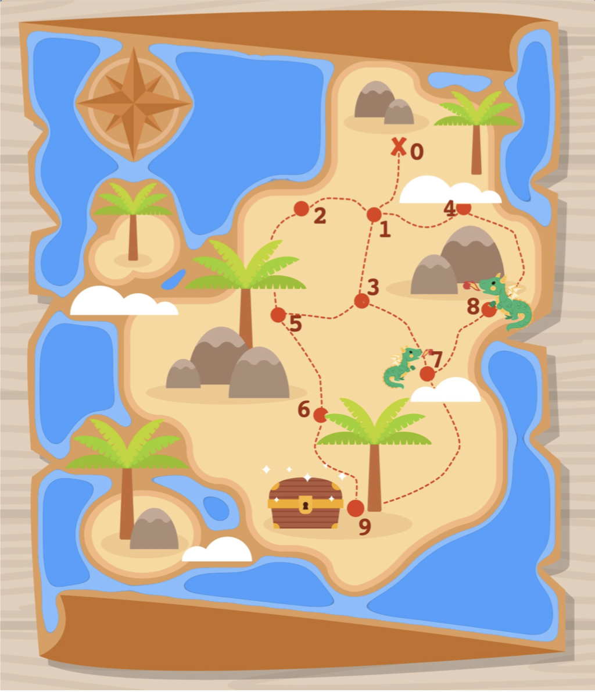

# Treasure Map Routing

## Solution Description
### Problem 1: Find the shortest path

The treasure map can be considered as a graph, where we have nodes, and the roads are connections (edges) between the
nodes. Since traveling from one node, to the next, always takes 5 minutes, the edges of the graph have uniform weight.
The shortest path, is then the path with the least amount of nodes. 

A simple way to solve this is by using the Breadth First Search. In breadth first search, we start at node 0, and then
visit all nodes directly connected to 0, in the above image node 1. And then for each of these nodes (i.e 
nodes 1) we go to the nodes that are directly connected to each of those node(s), and then so on. As shown in the (nice)
graphic below. 

 
         0         <- start
         |
         1         <- nodes checked in round one
       / | \
      2  3  4      <- nodes checked in round two
      |  |  |
      5  7  8      <- nodes checked in round two
      |  |
      6  9         <- nodes checked in round three

Node 9 appears first on the path `[0, 1, 3, 7, 9]` which is the shortest path. 

### Problem 2: Dragons
Since it takes 5 minutes from node to node, and a dragon sneezes every 15 mins, we need to make sure that we are not on 
a dragon node at a multiple of 3 `i.e 3,6,9,....`. 

There are 2 types of paths:
1. The path, already fulfills the above criteria (no dragon nodes on position 3,6,9,...).

2. The path contains at least one dragon node at index 3,6,9,...
    
    a. If the path contains dragons at 3 consecutive nodes of the path eg: Path= [1,2,3,4,5,6] Dragons=(3,4,5)
    then there is no way this can lead to a valid path and we ignore this route. Because we cannot cycle in a way to
    avoid all the dragon nodes. 
    
    b. Else we can circle the nodes before the dragon to allow crossing the dragon when he is not sneezing.
    eg `path: 0->1->2->3->4` and given dragon at 3. A possible solution would be `[0->1->2->1->2-3->4]` by circling over 
    1 and 2 we delayed reaching 3 by 10 mins, so instead of reaching 3 at 15, we reach at 25, avoiding the burn. 
    (See [get_treasure_avoiding_dragons](src/treasure_finder.py#L27))

For this solution, we can try and find all the possible paths from the start till the finish. Once we have all possible 
paths, paths that match 2b are expanded by cycling around nodes before the dragon node (hence become longer). 

We can then find the shortest path by simply comparing the length of the nodes. 

**NOTE: The implementation can be further optimized by investigating the potential size of solutions that match criteria
2b and then comparing their length to solutions that match point 1 and then only do the path-expansion of 2b if needed, since
that could be a potentially expensive operation, its not implemented like this as it would adversely effect the readability
of the code, and might not add significant performance boost** 

### Problem 3: Annoying neighbour

For Problem 3, we are asked to avoid the roads taken by the neighbour. Its also said that the neighbour will always take
the shortest path. For this we can first find the shortest path and know what path the neighbour will take.
Once we know that, we simply update the graph, and remove the roads taken by the neighbour and compute the 
shortest path for this updated graph. This will give us the shortest path avoiding the roads taken by out neighbour.

### Problem 4: Helpful Signs
Hmm, this question is somewhat vague. What we know from the question is: 
1. There are 2 famous mountains on the island (nothing about the distance between them, it could be possible they are
next to each other?)
2. There are sign-boards on each node that indicate the time to travel to each mountain. (Do the signs give time to 
mountains when following roads? I suppose so.. What if there is only a single road at a node?)
3. What is the relation of the treasure location to the mountains? (is it in the direction of mountain A or in 
in the opposite direction? Or is it in the middle of both mountains?)

Point 3 is the one that is most concerning. Since we don't know where the treasure is located in respect to the mountains, 
its hard to say if they can be of any real help. However I suppose, consider the example: When navigating from Berlin to Stuttgart, we 
know we need to drive south, we could start off by following directions to cities that are in the south, eg: Leipzig, and 
once near Leipzig, we start following the directions to the next city down south, till we start seeing directions for Stuttgart
and follow that then. 

In a similar way, I assume, we could follow the path to the mountain that is closest to the treasure (if that can be figured out),
and once close enough, leave that trail and follow the trail to the treasure. Makes sense?

Another idea is to maybe use the diff of the distance of each mountain at consecutive nodes, and that would give us an idea
of where we are heading, and use that information to somehow navigate to the treasure? (Again, will need to know the position
of the treasure w.r.t the mountains)
  

## Solution execution
I have implemented the solution in python because: **The setup was provided in python, it was easy to get started, and I could reuse ALL of the provided code.**

The project uses python types to give much nicer function definitions and also enable to IDE to assist and help with 
code completion. You will therefore need at least python 3.6 (Docker image uses python 3.7). 

The unittests present in [test folder](test)

To simplify the sharing of the project, the project has a [Dockerfile](Dockerfile) that sets up the execution in a docker
container. The docker build also runs the tests at build time. 

### Docker
Easiest way to run is execute the `docker_run.sh` file located at the root of the project. This script builds and runs
the routing container with all the necessary parameters (to share volume)

Alternatively you could also do what the `docker_run.sh` scrip does, i.e 
1. build the docker image by running `$ docker build -t routing .` at the root of the project
2. run the docker image `docker run -v $PWD:/usr/src/treasure-map-routing --rm routing:latest`

### No Docker
If you can't use the docker setup, you can also execute the solution, but you will need

1. Install Python 3.6 or later 
2. You will need to add project root to the env variable PYTHONPATH ``$ export PYTHONPATH=$PYTHONPATH:`pwd` ``
3. then run `$ python src/pathfinder.py resources/treasure_maps.txt` from the root of the project

**NOTE: If you have any issues regarding running, let me know, I am sure we can solve them together**
